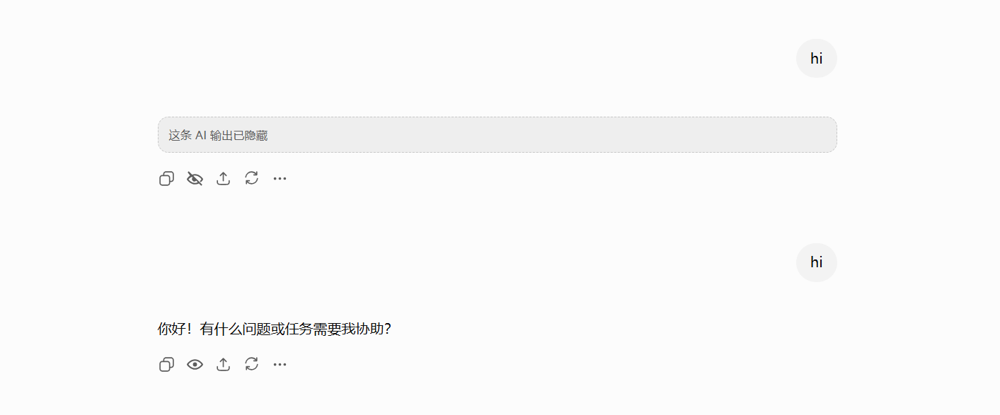

# ChatGPT Message Hide

在 ChatGPT 每条 AI 回复的「回复操作」区域添加隐藏/显示按钮，支持一键隐藏或恢复单条 AI 输出。隐藏状态持久化到 localStorage。

## 截图

## 功能

- 每条 AI 回复的操作栏新增眼睛图标按钮
- 点击隐藏后 AI 回复内容折叠为一行占位提示，再次点击恢复
- 隐藏状态跨会话持久化（localStorage）
- 适配页面 SPA 路由切换和 DOM 动态变化
